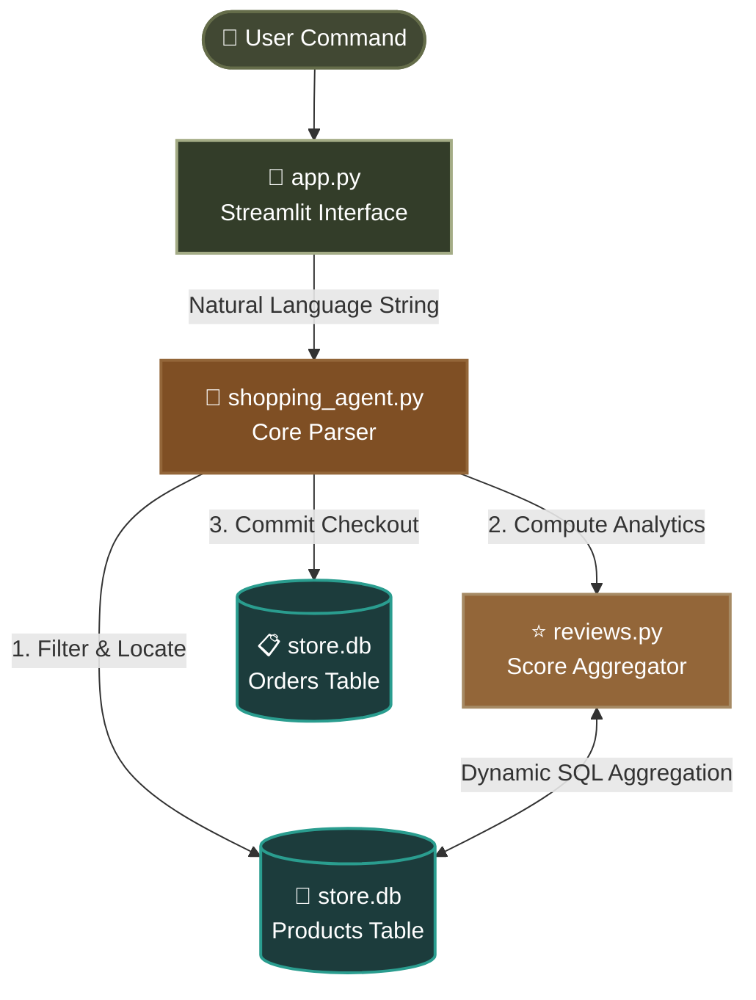

<div align="center">

<br/>


```

░██████╗ ██╗   ██╗ ░█████╗ ░██████╗ ░██████╗ ░███████╗ ██████╗░
██╔════╝ ██║   ██║ ██╔══██╗ ██╔══██╗ ██╔══██╗ ██╔════╝ ██╔══██╗
╚█████╗  ███████║  ██║  ██║ ██████╔╝ ██████╔╝ █████╗   ██████╔╝
╚═══██ ╗ ██╔══██║  ██║  ██║ ██╔═══╝  ██╔═══╝  ██╔══╝   ██╔══██╗
██████╔╝ ██║  ██║  ╚█████╔╝ ██║      ██║      ███████╗ ██║  ██║
╚═════╝  ╚═╝  ╚═╝   ╚════╝  ╚═╝      ╚═╝      ╚══════╝ ╚═╝  ╚═╝

```

<h3>🌿 AI-Powered Grocery Agent 🌿</h3>
<p><i>An Intelligent Natural Language Commerce Engine powered by Streamlit & SQLite</i></p>

<br/>


<br/>

> **An end-to-end local shopping assistant that interprets natural language, queries a live relational SQLite grocery catalog, compiles instant multi-row review statistics, and processes checkouts automatically.**

<br/>

---

</div>

<br/>

## 🛠️ Feature Overview

<table border="0">
<tr>
<td width="50%" valign="top">

### 🧠 &nbsp; Natural Language Query Router
Type commands exactly how you say them. The engine seamlessly handles intent classification, determining when to search categories, when to check grades, and when to execute checkout tables.

```text
You › "Find organic honey under $15 with 4+ stars"
Bot › 🔍 Queries database filter [is_organic = 1]
    › 📊 Batches sub-query out to reviews execution
    › 🛒 Generates sorted product list cards

```

### 📊   Dynamic Analytics Resolution

`reviews.py` relies on targeted database aggregation routines instead of hardcoded strings. It calculates true running averages and total review volume instantly upon request.

```python
# Real-time data aggregation pipeline
{"product_id": 1, "average_rating": 4.63, "review_count": 4}

```

### 🌿   Pure Organic Scoping

Built with explicit item classification tags like `is_organic`. Easily isolates premium small-batch agricultural lines from mass-market variants.

### 🗃️   Zero Cloud Footprint

An entirely offline execution ecosystem. Running `setup_db.py` completely handles schema initialization and inserts seed values locally in seconds.

---

## 🏗️ Architecture Execution Flow



---

## 📁 Repository Blueprint

```text
shopping_agent/
│
├── 📄 app.py               │ Streamlit web workspace & state loop 
├── 🤖 shopping_agent.py    │ Language routing core & transaction boundary controller
├── ⭐ reviews.py           │ Relational statistics calculator (AVG/COUNT)
├── 🗃️ setup_db.py          │ Automative table compiler & grocery database builder
├── 💾 store.db             │ Local relational database instance (SQLite3)
└── 📋 requirements.txt     │ App runtime package manifests

```

---

## 🗃️ Database Blueprint & Schema Details

The environment leverages structured relational configurations engineered cleanly inside `store.db`:

### 1. Structural Schema

```sql
-- Core Catalog
CREATE TABLE products (
    id INTEGER PRIMARY KEY,
    name TEXT NOT NULL,
    category TEXT,
    price REAL,
    description TEXT,
    is_organic INTEGER DEFAULT 0
);

-- Aggregated User Feedbacks
CREATE TABLE reviews (
    id INTEGER PRIMARY KEY AUTOINCREMENT,
    product_id INTEGER,
    rating REAL,
    reviewer_name TEXT,
    review_text TEXT,
    FOREIGN KEY (product_id) REFERENCES products(id)
);

-- Transaction Ledger
CREATE TABLE orders (
    id INTEGER PRIMARY KEY AUTOINCREMENT,
    product_id INTEGER NOT NULL,
    product_name TEXT NOT NULL,
    price REAL NOT NULL,
    ordered_at TEXT NOT NULL DEFAULT (datetime('now')),
    FOREIGN KEY (product_id) REFERENCES products(id)
);

```

### 2. Seed Directory Snapshot

`setup_db.py` populates **32 premium grocery profiles** mapped out across standard operational categories:

|  | Category Group | Inspected Properties & Subsets | Sample Products Seeded |
| --- | --- | --- | --- |
| 🍯 | **honey** | `price`, `is_organic`, `rating` variations | Organic Raw, Wildflower, Premium Manuka, Clover |
| 🥑 | **oil** | Smoke thresholds, refinement classifications | Extra Virgin Olive, Flaxseed, Cold-Pressed Avocado |
| 🌰 | **nuts & seeds** | Roasting characteristics, salt additives | Raw Organic Almonds, Dry-Roasted Cashews, Chia |
| 🌾 | **grains** | Milling structures, nutritional metrics | White Quinoa, Whole Rolled Oats, Organic Brown Rice |
| ☕ | **tea & coffee** | Infusion notes, single-origin packaging specs | Sencha Green Tea, Chamomile, Ethiopian Whole Bean |
| 🍎 | **snacks** | Sweetener content parameters, fruit compositions | Organic Oats Granola, Crispy Rice Cakes, Dried Mango |
| 🥛 | **dairy-alt** | Fortification metrics, fat consistency formulas | Almond Milk, Barista Oat Milk, Full-Fat Coconut Milk |

---

## 🚀 Installation & Launch

### 1. Build Environment

```bash
# Clone the repository
git clone [https://github.com/anushkaaa26/shopping-agent.git](https://github.com/anushkaaa26/shopping-agent.git)
cd ai-shopping-assistant

# Initialize a standard sandboxed environment
python -m venv .venv
source .venv/bin/activate  # Windows terminal: .venv\Scripts\activate

# Update workspace requirements
pip install -r requirements.txt

```

### 2. Prepare Databases

Bootstrap your database instance cleanly with schemas and mock records before spinning up your web application:

```bash
python setup_db.py

```

```text
✔ Connection established with local workspace
✔ Catalog populated with 32 baseline organic items
✔ User feedback ledger successfully established

```

### 3. Verification & UI Initialization

Confirm your statistical processing mechanisms run flawlessly, then launch your Streamlit engine:

```bash
# 1. Run local diagnostic test
python reviews.py

# 2. Deploy interface dashboard
streamlit run app.py

```

---

## ⚙️ Engineering Deep-Dives

### 🛡️ Programmatic Batch Subqueries

To securely process bulk rating queries inside `reviews.py`, the engine generates safe parameterized placeholders dynamically matching input dimensions, completely neutralizing potential SQL injection avenues:

```python
placeholders = ",".join("?" * len(product_ids))
query = f"SELECT product_id, AVG(rating), COUNT(*) FROM reviews WHERE product_id IN ({placeholders}) GROUP BY product_id"

```

### 🔒 Freeze-Frame Checkouts

The programmatic boundary inside `shopping_agent.py` validates that item costs are fixed instantly at the point of confirmation, locking historical sales values directly into the transaction system ledger via system defaults: `ordered_at TEXT DEFAULT (datetime('now'))`.

---

## 🤝 Contribution Guidelines

1. Fork the repo and cut an isolated workspace branch (`git checkout -b feature/NewFeature`).
2. Implement clean code parameters ensuring proper database session closings.
3. Commit adjustments with standard descriptive signatures (`git commit -m 'feat: refine database filters'`).
4. Push structural code up stream and open an evaluation Pull Request.

---
